# Color Preview 用户指南

## Color Preview 是什么？

对于许多程序员来说，开发时选择配色方案是一件令人头疼的事情，特别是开发移动应用的时候。

于是，Color Preview 应运而生了！

这个APP是为了减少设计移动应用时在配色方案上花费的时间。在这个APP上，你可以创造自己的配色方案，并且预览这一套配色方案在几种常见的界面的表现效果，而不需要写代码来实现。在确定了方案后，程序可以把对应的 `color.xml` 分享至你的电脑，以便导入到 Android Studio。除了创造自己的方案外，你还可以在社区中查看、分享并获取其他人提供的配色方案。你可以收藏任何配色方案。

---

## 快速上手

本文档将对 Color Preview 进行介绍，让每个人都能快速入门。

---

## 登录 & 注册

打开 APP ，首先你需要进行登录。

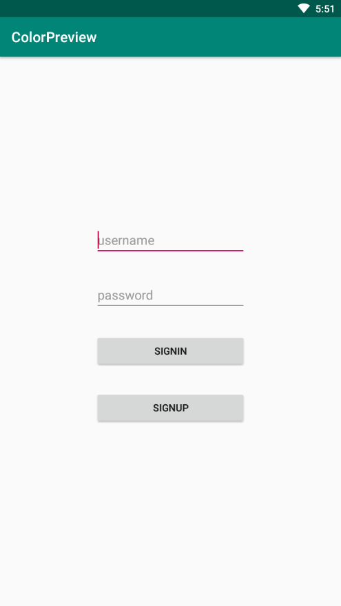

没有账号？没问题，来注册一个吧！

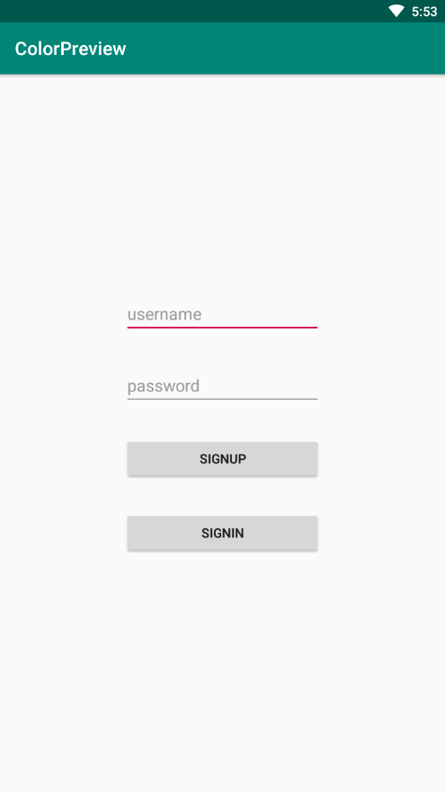

---

## 主界面

进入APP后，默认打开的是 Home 界面。

这里采用时间线的方式，展示所有用户最新的的创作与设计。

你可以对这些设计进行收藏和分享，点开卡片查看详情。

下拉可以刷新。

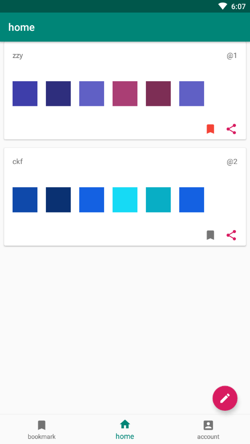

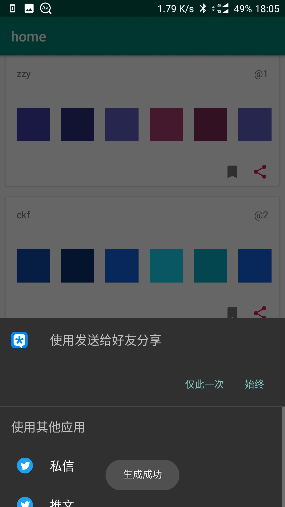

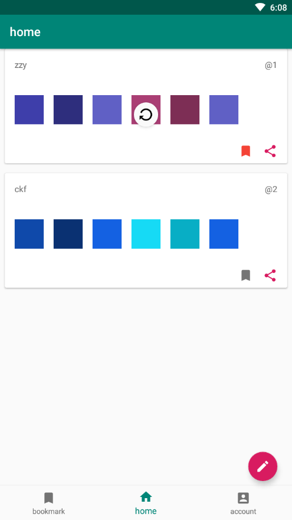

---

## 书签 & 收藏

通过下方的导航栏，你能够进入书签页面。

这里你可以看到所有你收藏过的设计。

你同样可以对它们进行各种操作。

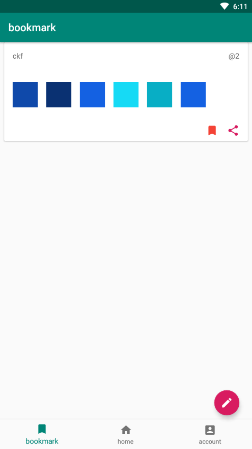

---

## 个人

通过下方的导航栏，你能够进入个人页面。

这里有所有你的创作。

分享、修改、删除等操作都可以在这里完成。

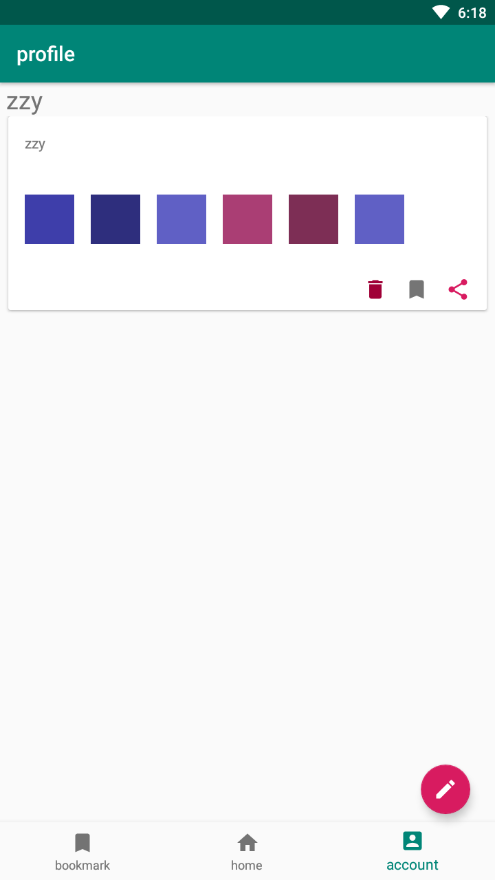

---

## 开始创作

你可以随时随地的点击右下角的铅笔图标开始记录你的新灵感。

### 创作

每份设计中包含了八个颜色，她们分别是 `Primary Color` , `Primary Light Color`, `Primary Dark Color`, `secondaryColor`, `secondaryLightColor`, `secondaryDarkColor`, `primaryTextColor`, `secondaryTextColor` 。

但是你只需要指定四个颜色 `Primary Color`, `secondaryColor`, `primaryTextColor`, `secondaryTextColor` ，其他的四个颜色将根据你选择的颜色自动生成。

点击下方的标签开始设计吧！

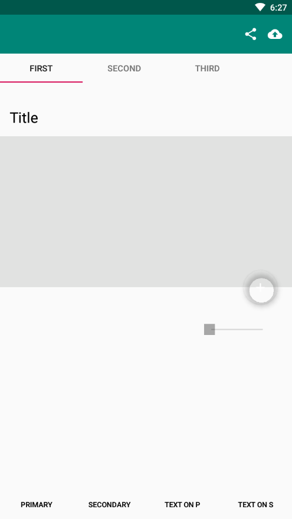

你可以拖动下方的两个滚动条进行调整，点击上方的小圆点进行选择。

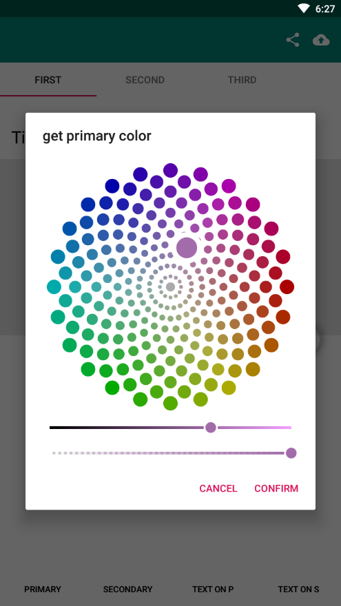

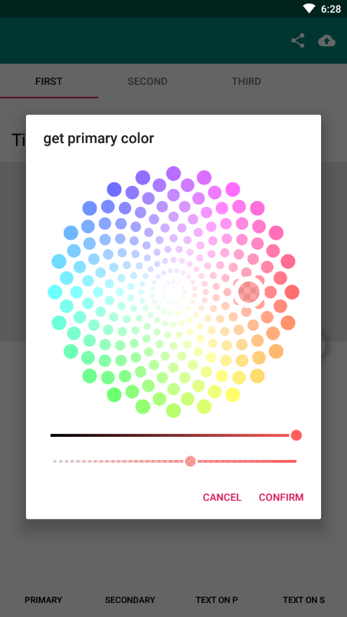

---

### 预览

设计完成后，你可以通过提供的 Android 中最常见的三个界面进行预览，品味你的设计。

你也可以与它们交互来进一步测试

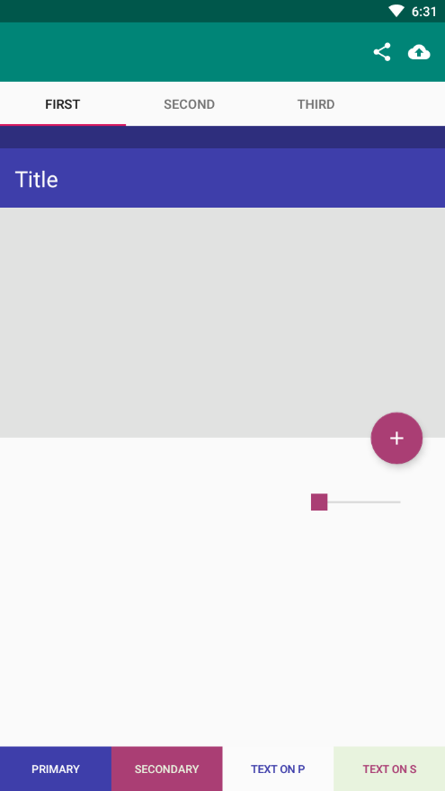

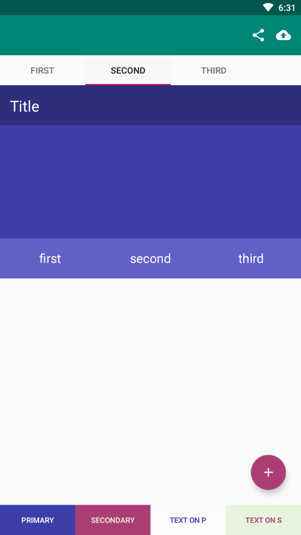

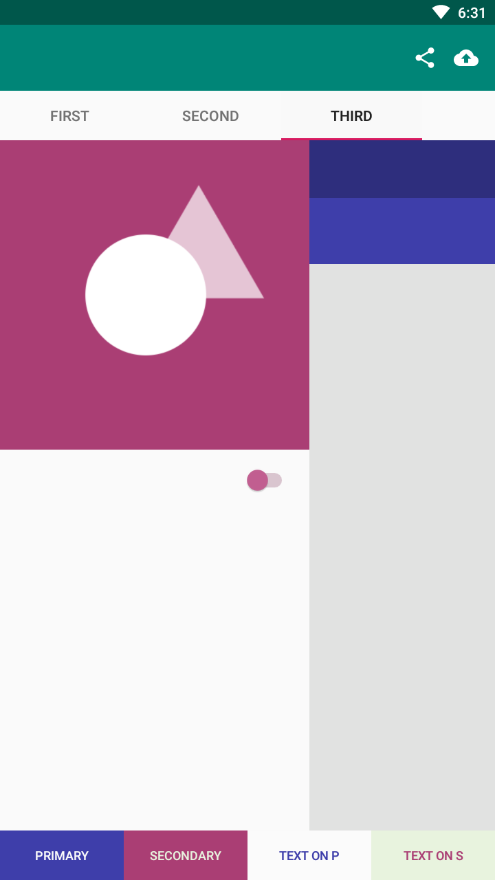

---

### 发布

一切OK后，点击右上角的图标，进行发布。

取一个响亮的名字吧！

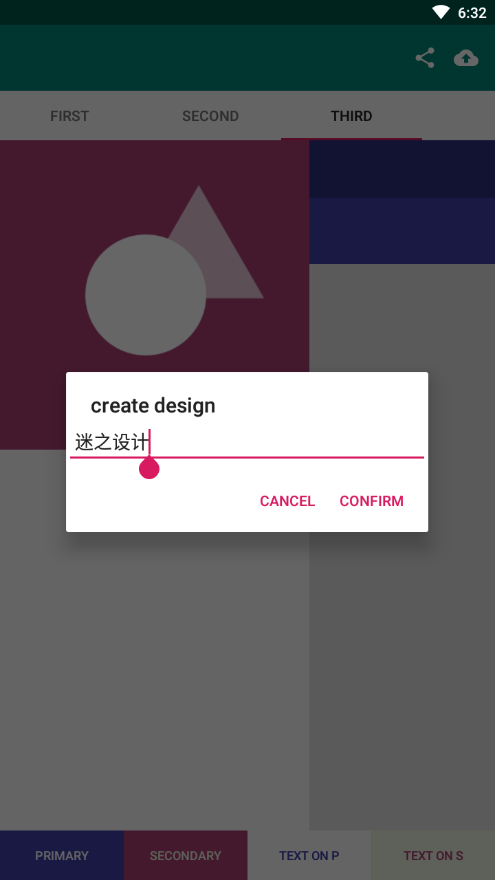

---

### 分享 & 导出

设计完成怎么分享和导出呢？

点击右上角的分享按钮，APP 将自动生成 `colors.xml` 并进行分享，你可以直接将这个 xml 放入你的Android Studio ！


> colors.xml

```xml
<?xml version="1.0" encoding="UTF-8"?>
<resources>
	<color name="primaryColor">#3e3eaa</color>
	<color name="primaryLightColor">#6060c5</color>
	<color name="primaryDarkColor">#2e2e7d</color>
	<color name="secondaryColor">#aa3e74</color>
	<color name="secondaryLightColor">#c56093</color>
	<color name="secondaryDarkColor">#7d2e55</color>
	<color name="primaryTextColor">#fbfbfb</color>
	<color name="secondaryTextColor">#e8f3de</color>
</resources>
```

---

## 再创作

感觉有的地方需要改进？

点击已有的设计可以进行修改！

当然你也可以点开别人的设计进行再创作。